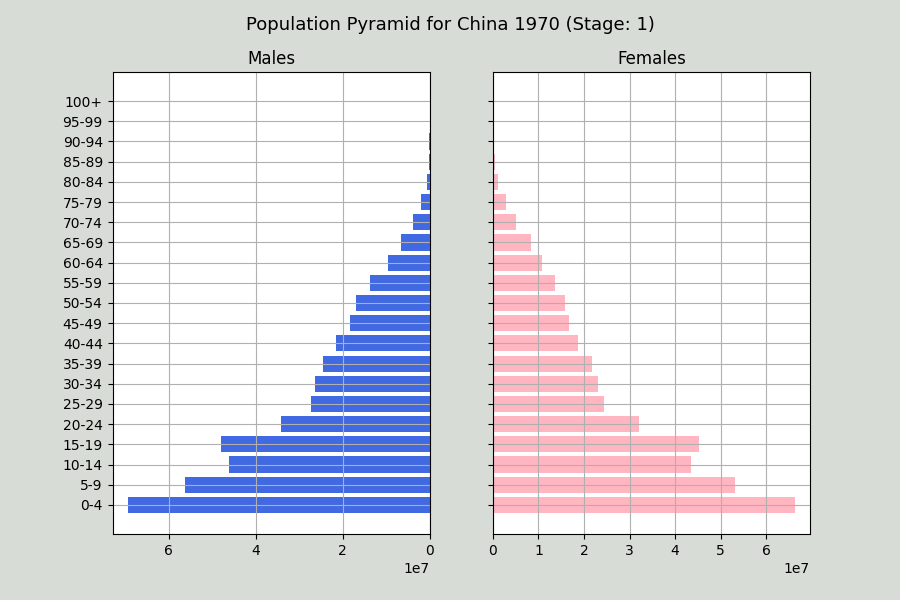
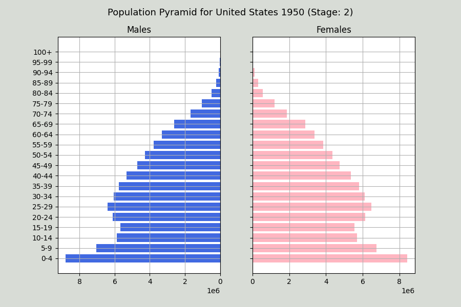
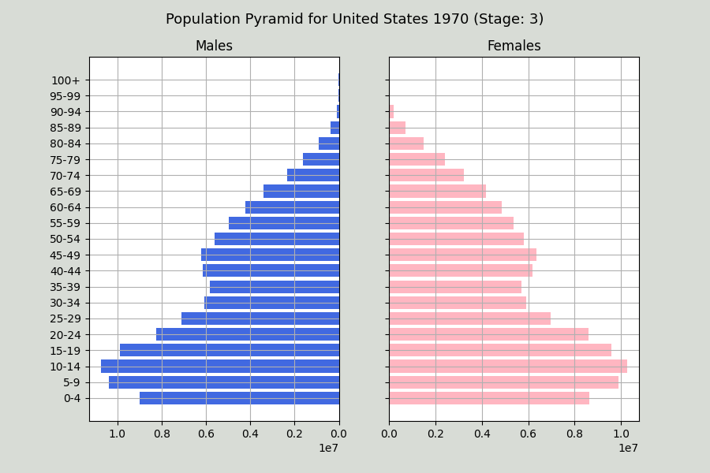
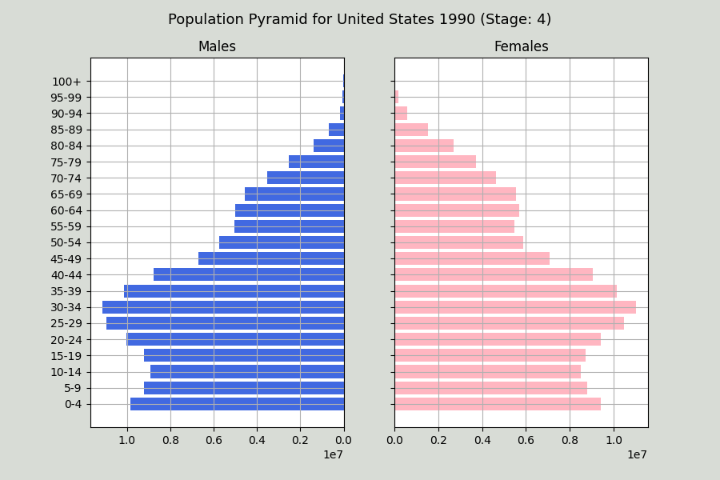

# BoilerMake 2022 Hackathon

## Introduction

This project focuses on classifying the stage of the demographic transition model (DTM) for a particular country. The DTM focuses on historical population trends of two demographic variables: the birth rate and death rate. These two variables play a role on the economic and human development within a country. Specifically, there are four stages that each country will go through. 
  - Stage 1 (Pre-industrial stage)
    - Applies to most of the world before the Industrial Revolution. Can be identified by a high birth rate and high mortality rate.
    - 
  - Stage 2 (Transition stage)
    - Introduction of modern technology lowers the mortality rate but still keeps the birth rate high
    - 
  - Stage 3 (Industrial stage)
    - Birth rates gradually decrease as a result of improved economic conditions, increase in women's status, and access to contraceptives. This causes the birth rate to also go down.
    - 
  - Stage 4 (Post-industrial stage)
    - Birth rates and death rates are low which stabilizes the population. These countries tend to have stronger economies, better healthcare, and high proportion of working women. This stage consists of mainly developed countries. 
    - 

Classifying these stages can provide a lot of detail on how a country is going to develop in the future. We hope to provide this project as an educational and research tool that leads us into a brighter future. For example, many interdisceplinary classes go over this topic and this project can help students visualize DTM so that they can progress in their fields and make a positive difference.

*As a trial for our project, we decided to do a case study for five countries (USA, China, UK, India, and Russia). We hope to improve our technology by expanding the domain of countries.*

## Resources

https://www.populationpyramid.net/

https://populationeducation.org/what-demographic-transition-model/

## Python Packages

- tkinter
- ttkthemes
- matplotlib
- csv
- requests
- pandas
- matplotlib.pylot

## Using this Repository

Make sure to git clone this repository. After cloning, make sure all mentioned packages are installed and the program is ready for use!

## Video Presentation

https://youtu.be/M-KCBHvYIas

## Contributors 
- Manas Bommakanti
- Aryan Jain
- Roshan Raj
- Shrinivas Venkatesan
